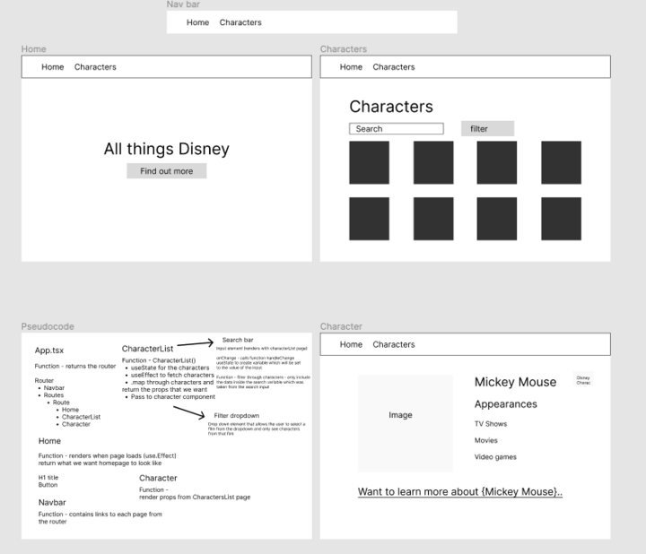

# SEB 78 project 2.

# Objective

For the second project in General Assembly SEB I was tasked with a partner to create an online interactive, multipage website that took data from an API. We were given a lot of scope to choose whichever API we liked and use that API anyway we seemed fit. Myself and my partner decided to use a Disney API which contained data on over 7000 Disney characters as well any extra information about each character such as which films they appeared in as well as an image for the character. We decided to use react to display characters through cards on the screen, to which the user could click on an individual character, at which they would be diverted to a new page for that character with extra informaiton. As our strech goal we wanted to have a form of filtering/searching for a character.

# Brief

## Overview

The second project is to **build a React application** that consumes a **public API**.

### Technical Requirements

Your app must:

- **Consume a public API** – this could be anything but it must make sense for your project.
- **The app should include a router** - with several "pages".
- **Include wireframes** - that you designed before building the app.
- Have **semantically clean HTML** - you make sure you write HTML that makes structural sense rather than thinking about how it might look, which is the job of CSS.
- **Be deployed online** and accessible to the public.

---

## Necessary Deliverables

- A **working application**, hosted somewhere on the internet
- A **link to your hosted working app** in the URL section of your Github repo
- A \*\*git rep

# Deployment Link

https://seb-78project2.netlify.app/

# Installation

- Clone the repository:
  https://github.com/jamessellman/SEB-Project-2
- Install dependancys
  (npm i)
- Run vite to display project online
  (npm run dev)

# Technologies used

- Bulma
- React
- CSS
- HTML
- Insomnia
- Vite

# Timeframe & Working Team

- For this project I was paired with another General Assembly student Elizabeth Tablot.
- The timeframe for this project we were given 2 full days to complete our minimum viable product and any further stretch goals we had planned.

# Build/Code Process

# Day 1/first half day on project work

- We started our project on Wednesday afternoon, with a due date of Friday afternoon so only had 2 days to provide our MVP. We started by discussion what API we would like to work with an our ideas for what we would like to build. We decided upon an API Elizbeth found which was the Disney API and both liked the idea of displaying characters on cards on the page, with the user having the ability to click on a character and display further information. To ensure the API was suitable we used Insomnia to inspect the API and decided that we could useable data from the API and it was suitable for our needs.

- We wireframed our design of how we wanted each each page to look and then Pseudo coded for our project, see image.

- Once we were satisfied with our inital design and psudo code it was time to start building our project. Our instructor has provided us with the intial set up for our project, HTML, CSS and the intial app.tsx and main.tsx pages. We were also given Bulma to work with. We decided to start by creating 5 component pages, including a home page, navbar, and 3 pages to display and render our data. We that exported the functions on each component page and imported them on our App.tsx page.

- We set up the Router on the app.tsx page, and created pathways between each page. We also added a navbar to allow the us to navigate to each page and tested this by using vite to preview our page, and clicked on the navbar button to move from page to page. We rendered some temporary JSX on each component so we know that the page was changing.

- After we had the inital pages set up, we added some basic JSX and stying to have a basis to work with. We set up cards on the page we wanted to show our characters in preparation for adding the API and data.

- Next we focused on adding the API, using an Async function to grab the data, convert it to JSON and sort the data in a variable we could use. As the data would be interacted with by the user, we had to add a react.useState and pass the data through a setCharacters function. At this point we console logged the data to ensure it was being pull through correctly.

- Once we were happy that we had the data we required, we looked at mapping through data and creating props so that we could pass that data down into the Character component which already had Bulma cards set up. We passed the props through and was able to display the Character image and name on the card. As we were mapping through the data we were able to show mulitple characters on the page, and was able to render 50 characters.

# Day 2/ Full day

- The next day we decided to start by adding a search bar to our page with was currently displaying the characters which posed some interesting challenges. Firstly we decided to add an input into our JSX and with a onChange embedded inside that would call a function when used. As the user would once again be interacting with the page while using the search bar, we knew we had to create another useState that would set the state for the search bar, which we called setSearch. We then create a function called "handleChange" that would be called when the search bar was used that recorded the value of what was inputted into the search bar.

- Once we had a search bar that was recording user input, we then decided we need a function that could filter through the API (please see screenshot) to bring in the specific results that the user had typed in. We then decided to map through theses filtered results. This means that if the search bar has not been used, then we would map through the entire API, however, if there was some text in the search bar then we would only map through the results of the filter function, only returning results that match the user input.

- Next on our agenda was further functionality that the user would be able to click on specific character card, and we would take then to a new page, displauing further information about that character. To acheieve this, we added a new link to another component which we had already created and added a new pathway which uses the character ID. The character ID is a specific endpoint we found using the documentation on the API which we could use to target a specific charater and only render that character on the oage. We then create a new async function to pull data through the API again, but this time with a different url that dynmically took the ID to pull through results. We then mapped through these results to display the information we wanted on the page.

- The majority of the rest of our time on day 2 was spend styling the project. Once we were satisfied with our styling we had our MVP with half a day spare for stretch goals.

# Day 3/ half day

- For our final day working on the project we wanted to add some extra functionality by adding a drop down box in which the user could choose a film from the drop down and would return all the characters from that film. We started by adding a label element to our JSX with another onChange that would call a function called handle film change. We decided to hard code a few options for the user to choose, via an array of opject, which held the label which would be displayed in the drop down, and a value which matches the film data from the API.

We created another async function that would filter the API with the value of the film chosen from the array.

We amened our filter character function that was being used for the search bar, to also handle the filter for the drop down selction.

Finally, in the label for the drop down, we mapped through the the data that was being passed through the new async function and that when drop down was used, and hten passed this through as props to render on the page.

# Final product

- Home page

.png>)

- Characters list page

- Characters list page filtered with search bar

- Characters list page filtered with search bar & drop down

- Individual character page

# Key Learnings/Takeaways

- Feel more confident with react. After having to build our own App, I feel that i have a much greater understanding of the functionality of react
- This was the first time a used a styling framework such a Bulma. I know how to use it to a limited degree and will need more practice.
- Learned how to create multi-page apps, and navigate been pages
- More comfortable pulling data through APIs
- Learned how to have interactive filtering on data.

# Bugs

- At this time there a no noticable bugs as its quite a simple application. That being said the API does give some strange results about characters appearing in films that are not thier own. Also some characters do not have images.

# Wins

- Managed to create a working app in a 2 day period.
- Surpassed our mvp and managed to add in a couple of stretch goals
- We added a search bar that works in conjunction with our drop down, which added 2 layers of filtering
- Managed to pull upon our api on 3 separate occasions, each time pulling in a different set of data

# Future Improvements

- Given more time, I would like to redo some of the styling. The background image we currently have could be improved on with a more consistent colour scheme. I would also work on some of the formatting issues, to ensure that elements align vertically on the page, such as the search bar, filter drop down and the card elements which show the characters.
- Further functionality could be added to improve the interactivity on the website, such as having some sort of comparison function that would allow the user to compare the data pulled through from 2 characters on the screen at the same time.
- The api has a lot more data than we decided to render on the page. The API has more than 7000 characters which we could have pulled through, however it would have caused the page to load/ render slowly. To counter this we amended the url query to only pull through the first 200 results. For further improvement I would like to be able to pull through all 7000 characters from the API. I would approach this by having a certain number of characters render on the page initially. Then have a button at the bottom which would take the user to the next page, that would then render the next set of characters to the page and so on. I believe this would be a suitable solution to bring in more data without causing loading issues.
